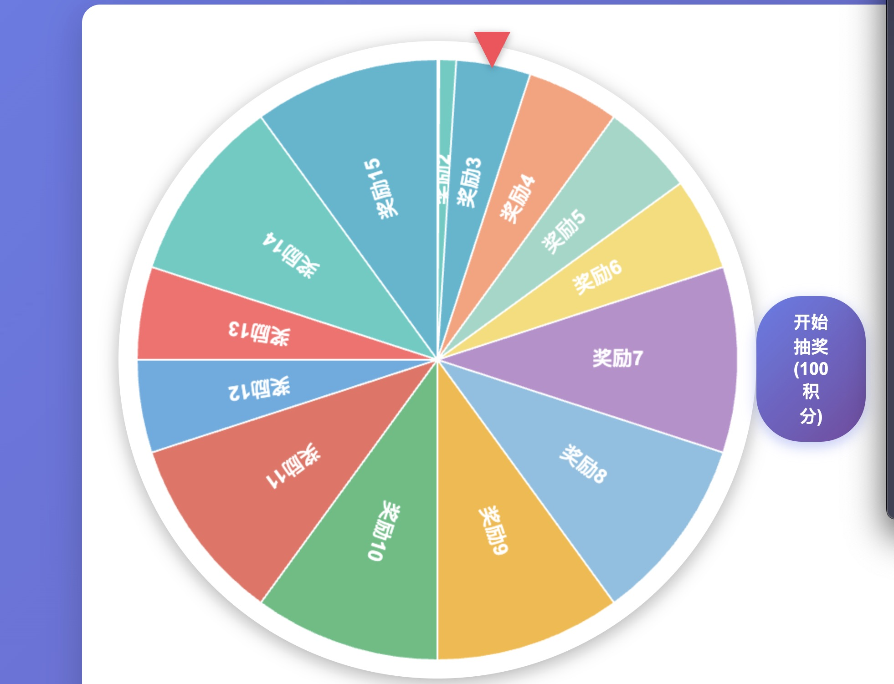

# 🎰 宝贝任务打卡 & 转盘抽奖系统

一个专为儿童设计的任务管理和激励系统，通过完成任务获得积分，累积积分可以参与转盘抽奖，帮助培养孩子的自律性和学习习惯。

## 📋 目录

- [功能特点](#功能特点)
- [快速开始](#快速开始)
- [使用说明](#使用说明)
- [界面介绍](#界面介绍)
- [功能详解](#功能详解)
- [数据说明](#数据说明)
- [注意事项](#注意事项)

## ✨ 功能特点

### 核心功能
- ✅ **多用户管理**：支持多个孩子独立使用，每个用户的数据完全独立
- ✅ **任务管理**：自定义任务列表，支持添加、删除、修改任务
- ✅ **积分系统**：完成任务获得积分，累积积分可参与抽奖
- ✅ **转盘抽奖**：可配置的转盘抽奖，支持概率设置和奖项限制
- ✅ **完成度奖励**：完成50%/75%/100%任务获得额外积分奖励
- ✅ **连续完成奖励**：连续完成任务可获得额外奖励
- ✅ **成就徽章**：50个不同的成就徽章，激励孩子持续进步
- ✅ **历史记录**：查看每日任务完成情况和抽奖历史
- ✅ **数据持久化**：所有数据自动保存到本地，无需担心丢失

### 激励机制
- 🎯 完成50%任务：额外奖励 +2 积分
- ⭐ 完成75%任务：额外奖励 +5 积分
- 🏆 完成100%任务：额外奖励 +10 积分
- 📅 连续完成任务：每周连续完成可获得额外奖励
- 🎰 抽奖系统：消耗积分参与转盘抽奖，获得惊喜奖励

## 🚀 快速开始

### 使用方式
1. 直接在浏览器中打开 `index.html` 文件
2. 无需安装任何软件，纯网页版应用
3. 支持所有现代浏览器（Chrome、Firefox、Safari、Edge等）

### 首次使用
1. 打开页面后，点击右上角的 **👤 用户管理** 按钮
2. 添加第一个用户（姓名、性别）
3. 选择该用户作为当前用户
4. 开始使用！

## 📸 截图展示



*系统主界面，包含转盘抽奖区域、任务管理、积分显示等功能*

## 📖 使用说明

### 1. 用户管理

#### 添加用户
1. 点击页面顶部的 **👤 用户管理** 按钮
2. 在弹出的对话框中，输入用户姓名
3. 选择性别（默认：女）
4. 点击 **添加用户** 按钮

#### 切换用户
1. 在用户管理对话框中，点击用户列表中的 **选择** 按钮
2. 选中的用户会显示在页面顶部"当前用户"处
3. **重要**：必须先选择用户才能进行任何操作

#### 编辑/删除用户
- 点击用户项右侧的 **✏️** 按钮可以编辑用户信息
- 点击 **🗑️** 按钮可以删除用户（至少保留一个用户）

### 2. 任务管理

#### 完成任务
1. 在任务列表中，找到要完成的任务
2. 点击任务右侧的 **○** 按钮，按钮会变成 **✓**
3. 任务完成后，会自动获得对应积分

#### 添加任务
1. 点击任务管理区域右上角的 **+ 添加任务** 按钮
2. 新任务会添加到列表末尾
3. 可以修改任务名称和积分值（默认1积分）

#### 修改任务
- **任务名称**：直接点击任务名称进行编辑
- **积分值**：点击积分输入框进行修改（最小1积分）
- **删除任务**：点击任务右侧的 **×** 按钮（至少保留1个任务）

#### 查看历史记录
1. 在"本周进度"区域，点击日历中的任意日期
2. 任务列表会显示该日期的完成状态（只读）
3. 点击 **返回今天** 按钮可切换回今天

### 3. 积分系统

#### 获得积分
- **完成任务**：每个任务完成后获得对应积分（默认1积分）
- **完成度奖励**：
  - 完成50%任务：+2积分
  - 完成75%任务：+5积分
  - 完成100%任务：+10积分
- **连续完成奖励**：连续完成任务可获得额外奖励

#### 消耗积分
- **转盘抽奖**：默认消耗100积分（可在右上角配置）
- 积分不足时无法抽奖

#### 配置抽奖消耗
1. 点击页面右上角的 **⚙️** 按钮
2. 输入新的抽奖消耗积分值
3. 点击确认保存

### 4. 转盘抽奖

#### 进行抽奖
1. 确保当前积分足够（显示在右上角）
2. 点击转盘下方的 **开始抽奖** 按钮
3. 等待转盘转动完成
4. 查看获得的奖励

#### 查看抽奖历史
1. 滚动到页面底部的"成就徽章"区域
2. 点击 **📊 统计** 按钮
3. 在弹出的对话框中，向下滚动查看"🎰 抽奖历史记录"
4. 历史记录按日期分组，显示：
   - 抽奖时间
   - 获得的奖品
   - 消耗的积分

#### 奖项限制（高级功能）
某些奖项可以设置限制：
- **年度限制**：一年内只能获得一次
- **月度限制**：一个月内只能获得一次
- **每日限制**：一天内只能获得一次

限制奖项在奖品配置区域可以设置。

### 5. 成就系统

#### 查看成就
- 在页面底部的"🏆 成就徽章"区域查看所有成就
- 已解锁的成就会高亮显示
- 未解锁的成就显示为灰色

#### 成就类型
系统包含50个不同的成就，包括：
- 任务完成相关成就（累计完成任务数）
- 积分相关成就（累计获得积分、当前积分）
- 连续完成成就（连续完成天数）
- 单日完成所有任务成就
- 使用天数成就

### 6. 统计信息

#### 查看统计
1. 点击"成就徽章"区域右上角的 **📊 统计** 按钮
2. 查看以下统计信息：
   - 累计完成任务次数
   - 累计获得积分
   - 最高连续天数
   - 当前等级
   - 打开记录天数
   - 累计抽奖次数
   - **抽奖历史记录**（详细列表）

### 7. 日历和历史记录

#### 使用日历
1. 在"📅 历史记录"区域，使用 **‹** 和 **›** 按钮切换月份
2. 点击日历上的任意日期
3. 查看该日期的：
   - 任务完成情况
   - 获得的积分
   - 完成的任务列表

#### 本周进度
- 显示本周每天的任务完成情况
- 点击日期可查看该天的详细情况
- 点击 **返回今天** 可切换回今天

## 🖥️ 界面介绍

### 页面布局

```
┌─────────────────────────────────────────┐
│  标题 + 用户管理 + 积分显示             │
├─────────────────────────────────────────┤
│                                         │
│           🎡 转盘抽奖区域                │
│                                         │
├─────────────────────────────────────────┤
│  📋 任务管理                            │
│  - 任务列表                             │
│  - 今日进度                             │
│  - 完成度奖励提示                       │
│  - 连续完成天数                         │
│  - 本周进度（日历）                     │
├─────────────────────────────────────────┤
│  📅 历史记录（日历）                    │
├─────────────────────────────────────────┤
│  🏆 成就徽章 + 统计按钮                 │
└─────────────────────────────────────────┘
```

### 主要区域说明

1. **顶部导航栏**
   - 当前用户显示
   - 用户管理按钮
   - 当前积分显示
   - 抽奖消耗积分显示
   - 抽奖消耗配置按钮

2. **转盘区域**
   - 彩色转盘（显示奖励编号）
   - 抽奖按钮
   - 抽奖结果提示

3. **任务管理区域**
   - 任务列表（可编辑）
   - 今日进度条
   - 完成度奖励提示
   - 连续完成天数
   - 本周进度日历

4. **历史记录日历**
   - 月份导航
   - 日历网格
   - 点击日期查看历史

5. **成就徽章区域**
   - 成就列表
   - 统计按钮
   - 清除数据按钮

## 🔧 功能详解

### 完成度奖励机制

#### 奖励规则
- **50%完成**：完成至少50%的任务，获得+2积分
- **75%完成**：完成至少75%的任务，获得+5积分
- **100%完成**：完成所有任务，获得+10积分

#### 优先级
- 如果完成100%，只给+10积分，不给其他奖励
- 如果完成75%，只给+5积分，不给50%奖励
- 如果完成50%，给+2积分

#### 奖励显示
在"今日进度"下方会显示可获得的完成度奖励提示：
- 🎯 完成50%任务，额外奖励 +2 积分
- ⭐ 完成75%任务，额外奖励 +5 积分
- 🏆 完成所有任务，额外奖励 +10 积分

已完成奖励的项目会显示 ✅ 标记。

### 连续完成奖励

- 每周连续完成所有任务可获得额外奖励
- 连续天数越多，奖励越多
- 中断后重新开始计算

### 成就系统详解

成就分为多个类别：

1. **任务完成成就**：累计完成任务次数达到一定数量
2. **积分成就**：累计获得或当前持有的积分达到一定数量
3. **连续完成成就**：连续完成任务的天数达到一定数量
4. **完美日成就**：单日完成所有任务的次数
5. **使用天数成就**：累计使用系统的天数

### 数据持久化

- 所有数据自动保存到浏览器的 `localStorage`
- 包括：
  - 用户信息
  - 任务列表
  - 积分数据
  - 完成历史
  - 抽奖历史
  - 成就状态
  - 奖品配置

### 清除数据

⚠️ **警告**：清除数据会删除所有记录，包括：
- 所有用户数据
- 任务完成记录
- 积分和统计
- 抽奖历史
- 成就进度

清除后，所有数据会重置为默认值：
- 默认积分：100
- 默认抽奖消耗：100积分

## 💾 数据说明

### 默认任务列表

系统预置了18个默认任务（每个1积分）：
1. 放学回家自己主动完成学校作业
2. 放学回家自己主动完成妈妈留的英文数学2页题
3. 放学回家自己主动完成妈妈留的英文2页书写/默写
4. 自己主动阅读30分钟书籍
5. 自己主动帮助爸爸妈妈做家务
6. 每天户外运动30分钟
7. 画一幅画/完成艺术创作
8. 每天早晨自己起床、刷牙、洗脸、完成个人卫生
9. 每天收拾好书包，检查书籍和需要携带的物品
10. 每天遇到保安叔叔/阿姨/认识的朋友可以很有礼貌的看着对方的眼睛打招呼
11. 放学回家可以给爸爸或妈妈讲述今天上课的内容
12. 放学回家自己主动完成妈妈留的中文2页书写/默写
13. 放学回家自己主动背10个新的英文单词
14. 放学回家自己主动背5个中文成语
15. 放学回家自己主动背1个古诗
16. 自己主动了解1个历史故事，并给爸爸或妈妈讲解
17. 自己主动上英文课，提前做预习并进行复习
18. 自己的玩具或者书用完可以归还到原来的位置

### 默认奖品配置

系统预置了多个奖品，每个奖品都有可配置的概率。

### 用户数据独立性

- 每个用户拥有完全独立的数据：
  - 任务列表（可自定义）
  - 积分和统计
  - 完成历史
  - 抽奖历史
  - 成就进度

## ⚠️ 注意事项

### 使用限制

1. **必须选择用户**：所有操作（任务、抽奖等）都需要先选择用户
2. **数据本地存储**：数据保存在浏览器本地，清除浏览器数据会导致数据丢失
3. **浏览器兼容性**：建议使用现代浏览器（Chrome、Firefox、Safari、Edge）

### 操作提示

1. **切换日期**：在查看历史日期时，任务列表会变为只读模式
2. **任务编辑**：只有查看今天时才能编辑任务
3. **积分不足**：积分不足时无法抽奖，会显示提示信息
4. **删除限制**：至少保留1个用户和1个任务

### 数据备份

如需备份数据：
1. 打开浏览器的开发者工具（F12）
2. 进入 Application/Storage 标签
3. 找到 Local Storage
4. 导出相关数据

### 常见问题

**Q: 如何重置某个用户的数据？**  
A: 可以在用户管理中选择删除用户并重新添加，或者清除所有数据。

**Q: 抽奖历史在哪里查看？**  
A: 点击页面底部的"📊 统计"按钮，在弹出的对话框中向下滚动，可以看到"🎰 抽奖历史记录"。

**Q: 如何修改奖品配置？**  
A: 奖品配置功能已隐藏（可通过开发者工具显示），主要用于设置奖品概率和限制规则。

**Q: 数据会丢失吗？**  
A: 数据保存在浏览器本地，清除浏览器缓存或使用隐私模式可能导致数据丢失。建议定期备份。

## 📝 更新日志

### 当前版本功能
- ✅ 多用户管理系统
- ✅ 任务管理和积分系统
- ✅ 转盘抽奖功能
- ✅ 完成度奖励机制
- ✅ 连续完成奖励
- ✅ 50个成就徽章
- ✅ 历史记录查看
- ✅ 抽奖历史记录
- ✅ 日历功能
- ✅ 统计信息
- ✅ 响应式设计

## 📞 技术支持

如有问题或建议，请检查：
1. 浏览器控制台是否有错误信息（按F12打开）
2. 是否选择了用户
3. 数据是否正确保存

---

**祝使用愉快！** 🎉

